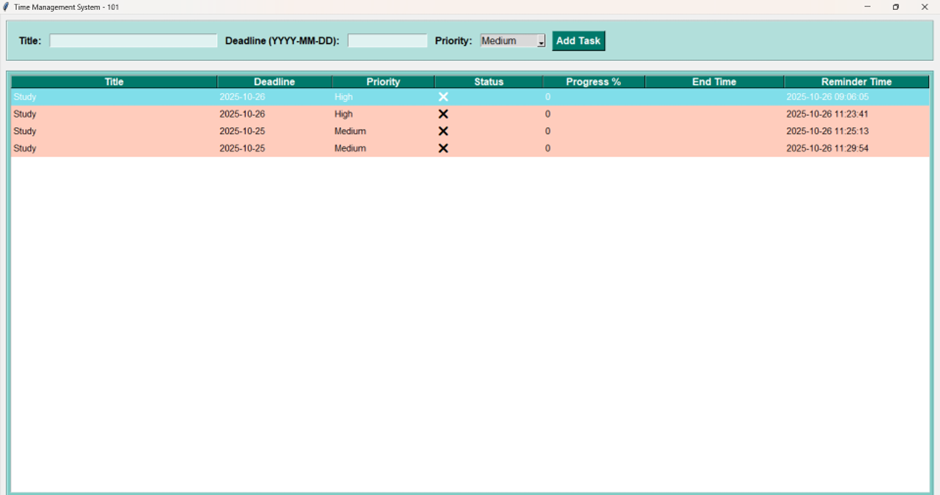

# 🕒 Time Management System

---

## 🧩 Abstract
The **Time Management System** is a software application designed to help individuals and organizations efficiently plan, monitor, and utilize their time. It provides tools for task scheduling, progress tracking, reminders, and performance monitoring.

This system improves productivity, reduces procrastination, and ensures timely completion of tasks. By automating scheduling and providing smart insights, it promotes discipline and accountability across academic and professional environments.

---

## 📘 1. Introduction
In today’s fast-paced world, effective time management is essential for success. People often struggle to balance multiple responsibilities, deadlines, and priorities. Manual time tracking is tedious, error-prone, and inefficient.

The **Time Management System** provides a digital platform for managing tasks, setting reminders, organizing schedules, and monitoring progress — making productivity simple, visual, and automated.

---

## 🎯 2. Objectives
The main objectives of the system are:

- 🗓️ Plan and organize daily, weekly, and monthly tasks.  
- ⏰ Provide reminders and notifications for upcoming deadlines.  
- 📈 Track task completion status and progress percentage.  
- 💡 Reduce missed deadlines through structured time visualization.  

---

## ⚙️ 3. System Overview
The Time Management System provides several key functional modules to streamline task and time management.

### **Modules**
1. **User Management Module**  
   - Handles login, registration, and profile management.  
   - Supports secure multi-user access.

2. **Task Management Module**  
   - Allows users to create, edit, and delete tasks.  
   - Each task includes title, description, priority, and deadline.

3. **Reminder & Notification Module**  
   - Sends reminders for upcoming or overdue tasks.  
   - Configurable for intervals (e.g., 1 hour or 1 day before the deadline).

4. **Progress Tracking Module**  
   - Displays task progress and performance summaries.  
   - Visual charts show productivity trends.

5. **Report Generation Module**  
   - Generates weekly and monthly productivity reports.  
   - Exports data to PDF or Excel for record-keeping.

---

## 🌟 4. Features
- ✅ **Task Scheduling** – Organize work by date, category, and priority.  
- 🔔 **Smart Reminders** – Alerts before deadlines to prevent missed tasks.  
- 📊 **User Dashboard** – Displays all pending, ongoing, and completed tasks.  
- 🧮 **Performance Analytics** – Monitors time usage and task efficiency.  
- 🌐 **Cross-Platform** – Works on different devices and environments.  
- 🔍 **Search & Filter** – Quickly locate tasks by keyword or category.  

---

### 🖥️ *Time Management System (Interface)*

---

## 💫 5. Speciality of the System
The **Time Management System** stands out due to its simplicity, interactivity, and visual engagement:

- 🧭 Converts traditional to-do lists into a digital planner.  
- 💬 Easy-to-use for both students and professionals.  
- 📈 Motivating dashboard for visual progress tracking.  
- ⚙️ Offers personalized reports and analytics.  
- 🌿 Encourages consistent daily planning habits.

Ideal for educational institutions, startups, and freelancers looking to structure their time efficiently.

---

## 💻 6. Technologies Used
- **Frontend:** HTML, CSS, JavaScript (for UI and interactivity)  
- **Backend:** Python (for processing and logic)  
- **Database:** MySQL (for storing user and task data)  
- **IDE/Tools:** Visual Studio Code  

---

## 🧱 7. System Architecture
The system follows a **three-layered architecture**:

1. **Presentation Layer:** UI (Task list, forms, dashboards)  
2. **Application Layer:** Logic for scheduling and reminders  
3. **Database Layer:** Storage and retrieval of user data  

This modular structure ensures scalability, flexibility, and maintainability.

---

## 🚀 8. Advantages
- Boosts personal and professional productivity  
- Reduces stress through better planning  
- Improves punctuality and accountability  
- Minimizes missed deadlines  
- Promotes balanced time usage  
- Encourages healthy work habits  

---

## 🔮 9. Future Scope
Planned enhancements include:

- 🤖 **AI-powered task prioritization** based on workload  
- 🎙️ **Voice-based task creation** using speech-to-text  
- ☁️ **Integration with Google Calendar or Outlook**  
- 📱 **Mobile version** for anytime access  
- 👥 **Team collaboration features** for shared productivity tracking  

---

## 🏁 10. Conclusion
The **Time Management System** is a modern, digital approach to productivity.  
By integrating **scheduling, reminders, and analytics** into one platform, it empowers users to manage their time effectively and stay focused.

This project highlights how **technology + discipline** can together enhance performance, organization, and overall quality of life.

---

### 📸 Interface Preview

---

> 💡 *“Don’t manage time — manage yourself. This system helps you do exactly that.”*
